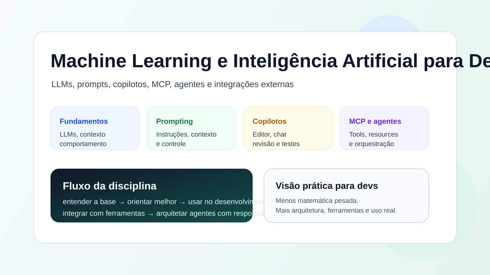

# Machine Learning e Inteligência Artificial para Devs

<figure><figcaption></figcaption></figure>

Este GitBook foi pensado para apresentar, de forma leve e prática, os
principais conceitos de IA generativa aplicados ao desenvolvimento de
software.

A ideia não é aprofundar matemática, treino de modelos ou teoria pesada.
O foco é dar ao aluno o contexto necessário para:

* entender como LLMs funcionam na prática;
* escrever prompts melhores para assistentes e agentes;
* usar copilotos de código com mais critério;
* conhecer o Model Context Protocol;
* montar um servidor MCP simples;
* enxergar como agentes tomam decisões e se conectam a ferramentas externas.

## Antes de começar

Nesta disciplina, a ideia é entender como a IA entrou no dia a dia do desenvolvimento de software de um jeito prático e direto.

Em vez de focar em teoria pesada, vamos trabalhar com uma ideia simples: entender o suficiente para usar bem.

Ao longo dos próximos tópicos, você vai ver:

* como LLMs funcionam na prática;
* como escrever prompts melhores;
* como usar copilotos de código;
* o que é MCP e por que ele é importante;
* como agentes se organizam e usam ferramentas externas.

## O que você deve levar desta disciplina

* Uma visão clara do ecossistema de IA aplicada ao desenvolvimento.
* Capacidade de reconhecer quando uma ferramenta de IA ajuda de verdade.
* Noções básicas de integração entre agentes, ferramentas e dados.
* Um repertório mínimo para conversar sobre IA com mais segurança técnica.

## O que você vai encontrar ao longo do material

Cada conteúdo foi pensado para combinar:

* explicação curta e objetiva;
* exemplos do mundo real;
* um pouco de visão arquitetural;
* espaço para imagens didáticas;
* atividades para fixação.

## Como este material está organizado

Cada conteúdo segue uma linha parecida:

1. visão geral do tema;
2. explicação objetiva dos conceitos principais;
3. exemplos práticos;
4. imagem ilustrativa com prompt para geração posterior;
5. atividades para fixação.

## Estrutura da disciplina

* [Conteúdo 1 - Fundamentos de LLMs para devs](conteudo-2/fundamentos-de-llms-para-devs.md)
* [Conteúdo 2 - Engenharia de prompts para agentes](conteudo-3/engenharia-de-prompts-para-agentes.md)
* [Conteúdo 3 - Copilotos de código na prática](conteudo-4/copilots-de-codigo-na-pratica.md)
* [Conteúdo 4 - Introdução ao Model Context Protocol](conteudo-5/introducao-ao-model-context-protocol.md)
* [Conteúdo 5 - Construindo um servidor MCP do zero](conteudo-6/construindo-um-servidor-mcp-do-zero.md)
* [Conteúdo 6 - Arquitetura de agentes e orquestração multiagente](conteudo-7/arquitetura-de-agentes-e-orquestracao-multi-agente.md)
* [Conteúdo 7 - Integração de agentes com ferramentas externas](conteudo-8/integracao-de-agentes-com-ferramentas-externas.md)
* [Conteúdo 8 - Material complementar e tópicos transversais](conteudo-9/material-complementar-e-topicos-transversais.md)

## Como navegar

* A página inicial funciona como abertura da disciplina.
* Cada conteúdo principal abre um bloco com subpáginas curtas.
* As páginas de `Atividades` fecham cada bloco com revisão e fixação.

## Observação pedagógica

Este material foi planejado para ser mais panorâmico do que técnico em profundidade. A proposta é que, ao final do semestre, o aluno consiga:

* entender o que cada tecnologia faz;
* reconhecer quando ela faz sentido;
* identificar os principais riscos;
* conectar os conceitos ao desenvolvimento real.
