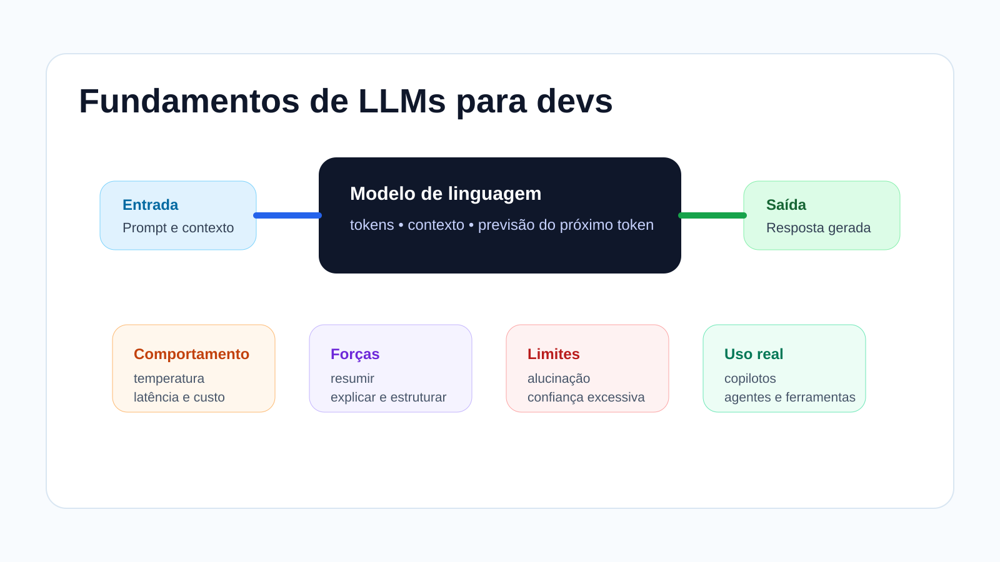

# Fundamentos de LLMs para devs

Antes de falar sobre agentes, MCP, copilotos e integrações, vale construir uma base sólida sobre o que um LLM faz e como ele se comporta na prática.

Nesta parte da disciplina, a ideia não é entrar em matemática pesada nem em detalhes de treinamento de modelos. O foco é entender o suficiente para usar bem essas ferramentas no contexto de desenvolvimento de software.

## O que você vai estudar aqui

Ao longo deste conteúdo, vamos organizar os fundamentos em cinco blocos:

1. o que é um LLM e como ele funciona;
2. contexto, memória e comportamento do modelo;
3. o que LLMs fazem bem e onde erram;
4. LLMs no desenvolvimento de software;
5. boas práticas e ponte para os próximos conteúdos.

## Objetivos de aprendizagem

Ao final deste conteúdo, você deve ser capaz de:

* explicar, com suas palavras, o que é um LLM;
* entender o papel de tokens, contexto e prompting;
* reconhecer capacidades e limitações do modelo;
* visualizar onde LLMs ajudam no trabalho de desenvolvimento;
* usar essa base para seguir com prompts, copilotos, MCP e agentes.

<figure><figcaption></figcaption></figure>

## Sequência das páginas

* [O que é um LLM e como ele funciona](o-que-e-um-llm-e-como-ele-funciona.md)
* [Contexto, memória e comportamento do modelo](contexto-memoria-e-comportamento-do-modelo.md)
* [O que LLMs fazem bem e onde erram](o-que-llms-fazem-bem-e-onde-erram.md)
* [LLMs no desenvolvimento de software](llms-no-desenvolvimento-de-software.md)
* [Boas práticas e ponte para os próximos conteúdos](boas-praticas-e-ponte-para-os-proximos-conteudos.md)

## Resumo

Este conteúdo funciona como a base conceitual da disciplina. Se você entender bem como um LLM responde, onde ele ajuda e onde ele falha, os próximos tópicos ficam muito mais naturais.
