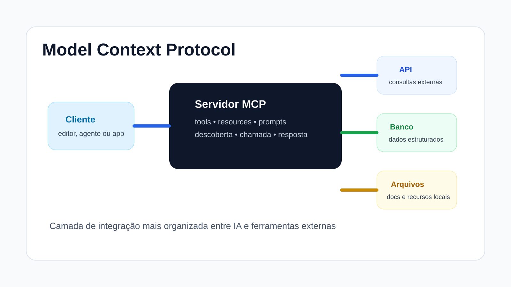

# Introdução ao Model Context Protocol

Depois de entender LLMs, prompts e copilotos, chegamos a uma pergunta importante: como conectar esses sistemas a ferramentas, dados e recursos externos de forma organizada?

É exatamente nesse ponto que entra o MCP.

Nesta parte da disciplina, a ideia é entender o protocolo não como algo excessivamente técnico ou abstrato, mas como uma peça prática de arquitetura para IA aplicada ao desenvolvimento.

## O que você vai estudar aqui

Ao longo deste conteúdo, vamos organizar o tema em cinco blocos:

1. o que é MCP e por que ele existe;
2. arquitetura básica do MCP;
3. como o MCP funciona na prática;
4. vantagens, limites e comparação com outras abordagens;
5. boas práticas e ponte para o próximo conteúdo.

## Objetivos de aprendizagem

Ao final deste conteúdo, você deve ser capaz de:

* explicar, com suas palavras, o que é MCP;
* entender a diferença entre cliente, servidor, ferramentas e recursos;
* enxergar o protocolo como uma camada de integração;
* comparar MCP com abordagens mais diretas;
* usar essa base para o próximo conteúdo, em que vamos construir um servidor MCP.

<figure><figcaption></figcaption></figure>

## Sequência das páginas

* [O que é MCP e por que ele existe](o-que-e-mcp-e-por-que-ele-existe.md)
* [Arquitetura básica do MCP](arquitetura-basica-do-mcp.md)
* [Como o MCP funciona na prática](como-o-mcp-funciona-na-pratica.md)
* [Vantagens, limites e comparação com outras abordagens](vantagens-limites-e-comparacao-com-outras-abordagens.md)
* [Boas práticas e ponte para o próximo conteúdo](boas-praticas-e-ponte-para-o-proximo-conteudo.md)

## Resumo

O MCP ajuda a organizar a integração entre sistemas de IA e ferramentas externas. Entender essa camada torna mais natural o próximo passo da disciplina: construir um servidor MCP do zero.
