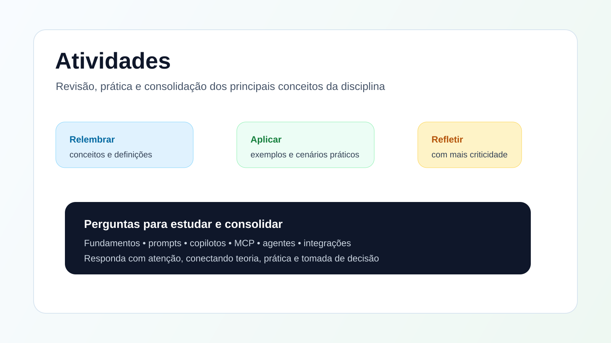

# Atividades

<figure><figcaption></figcaption></figure>

## Questões de estudo

1. Diga duas formas de integrar um agente com ferramentas externas.
2. Qual é o cuidado mais importante ao liberar acesso a uma ferramenta?
3. Cite um exemplo prático de integração com API, banco ou arquivo.
4. Em que situação MCP pode fazer mais sentido do que uma integração direta?
5. Por que logs e auditoria são importantes nesse tipo de integração?
